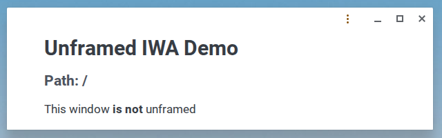
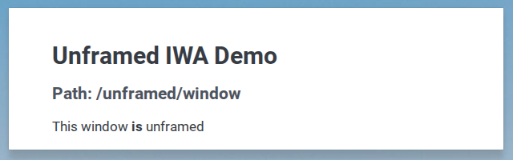

# Unframed Demo IWA

<a href="https://studio.firebase.google.com/import?url=https%3A%2F%2Fgithub.com%2Fedman%2Funframed-demo">
  <picture>
    <source
      media="(prefers-color-scheme: dark)"
      srcset="https://cdn.firebasestudio.dev/btn/open_dark_32.svg">
    <source
      media="(prefers-color-scheme: light)"
      srcset="https://cdn.firebasestudio.dev/btn/open_light_32.svg">
    
  </picture>
</a>

This is a demo IWA intended to exercise the `unframed` display mode feature.

## Introduction

The unframed display mode feature for IWAs in ChromeOS makes it possible for apps to display windows without a window "frame" surrounding the app content, giving IWA developers full control of the content of app windows.

Here is what an example app window normally looks like:

And here is what the same app looks like when it is unframed:

## Installing the demo

### Pre-requisites

* You need a ChromeOS device.
* You need Chrome version **146.0.7648.0 or later**.
* Navigate to `chrome://flags`.
* Enable the `#enable-isolated-web-app-dev-mode` feature flag to install IWAs.
* Enable the `#enable-unframed-iwa` feature flag.

### Option 1: Install via update manifest

*   Navigate to `chrome://web-app-internals`
*   Find "Install IWA from Update Manifest"
*   Paste in the the addresss 
    `https://unframed-isolated.web.app/releases/update_manifest.json`
*   Click "fetch" and "install"

### Option 2: Install via dev mode proxy

*   Navigate to `chrome://web-app-internals`
*   Find "Install IWA via Dev Mode Proxy"
*   Paste in the the addresss `https://unframed-isolated.web.app`
*   Click "install"

## Building and deploying the demo

*   `pnpm run build:release` - creates a new versioned signed bundle for the IWA in `./releases` and updates the manifest.
*   `pnpm run deploy` - builds and deploys the IWA to `https://unframed-isolated.web.app`.